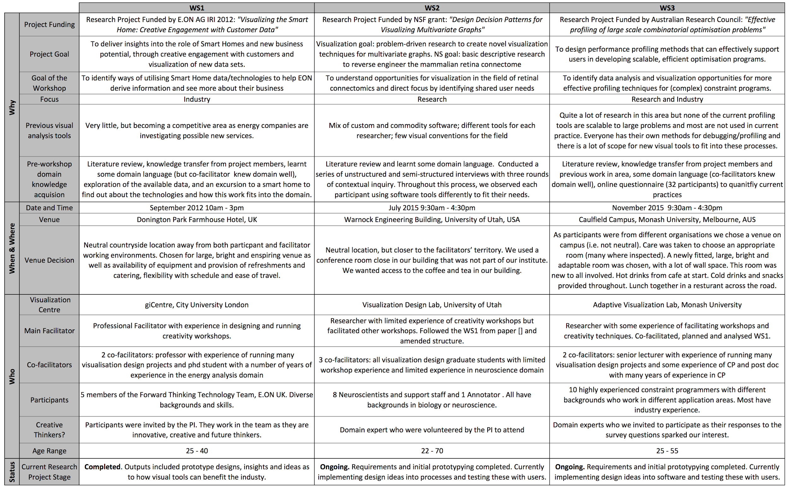
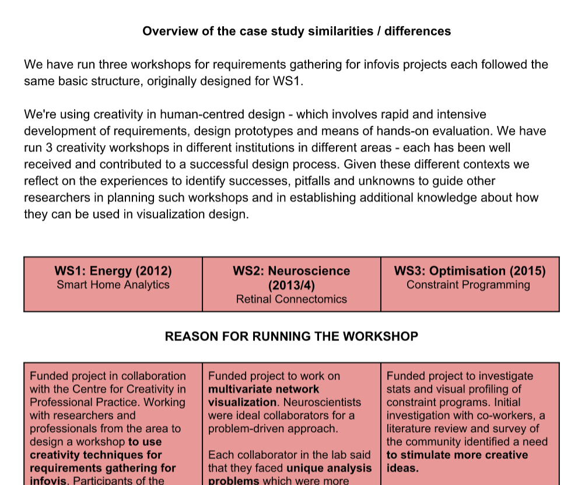

 - SG, JD, EK, MM, and SJ (with other colleagues) tried to analyze three workshops [P2, P4, P5].
 - Focused on low-level details, such as number of participants and location.
 - Proposed pitfalls for future workshops, including:
	- _Not staying on top of the photography during the workshop can mean that idea flow maybe broken in post workshop analysis._
	- _Not being prepared for unexpected circumstances, like having no wifi in the room. Prepare offline options and printouts_
	- _Ensure Post-it sizes and paper is right for the different activities. Pilot the activities with your materials_
 - Collectively decided that the ideas were not yet ready for publication.

 |  |
 | [Summary of comparison (png)] that focused on describing what happened within workshops instead of how to use workshops. |

 |  |
 | Screenshot of a 17 page written reflection (redacted) that documented our use of three workshops with similar methods. |

 [Summary of comparison (png)]: ../assets/documents/2016.06-beliv-summary.png
