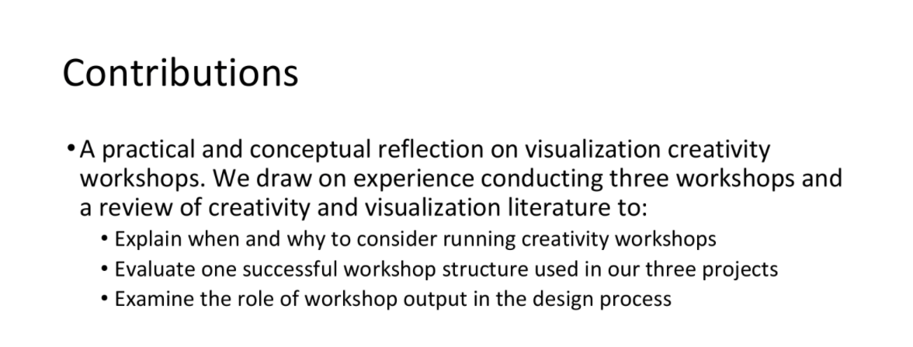

 - Examined [visualization workshop methods (pdf)] in larger context of creativity and design literature.
 - Collaboratively worked to outline a paper in [written outline (pdf)] and  presentation [pre-pre-paper talk (pdf)].
- Again, decided that the ideas were not yet ready for publication.

 |  |
 | A slide summarizing contributions from our [pre-paper talk (pdf)] Here, we are grasping at the concept of the framework and workshop process (“when and why to consider…”) but have not yet articulated it.  |

[visualization workshop methods (pdf)]: ../assets/documents/2016.08-chi-paper-methods.pdf

[written outline (pdf)]: ../assets/documents/2016.08-chi-paper-notes.pdf

[pre-pre-paper talk (pdf)]: ../assets/documents/2016.08-chi-pre-prepaper-talk.pdf

[pre-paper talk (pdf)]: ../assets/documents/2016.08-chi-prepaper-talk.pdf
