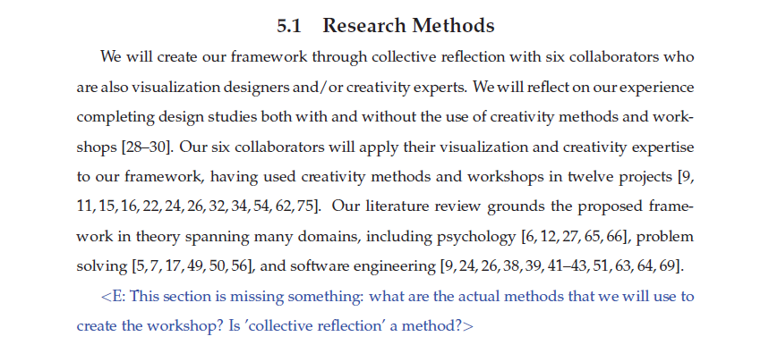

 - Created a [first draft (pdf)] of a Ph.D. dissertation proposal that identified a set of 34 key questions for the framework.
 - Completed three days of in-person analysis and discussions (EK, JD, SJ).

 |  |
 | Screenshot of the proposed research methods. We wrestled with questions about how to create knowledge from collective experience. Here, we describe our process as _collective reflection_ because we have not yet discovered the methodology of critically reflective practice. We have also not yet focused our work on _visualization_ creativity workshops. Hence, we cite 12 projects that we winnowed to 10 in the final paper. |

[first draft (pdf)]: ../assets/documents/2017.06-dissertation-proposal-for-discussion.pdf
