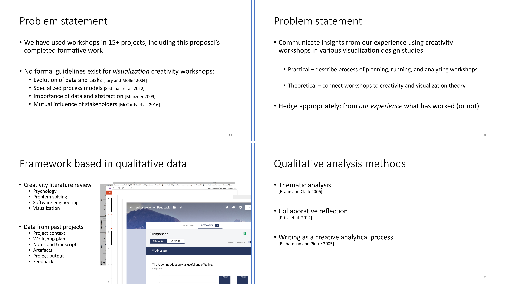

 - Formally proposed the creation of the framework in a Ph.D. [dissertation proposal (pdf)].
 - Summarized the framework in a [proposal defense (pdf)].
 - Used feedback on from Ph.D. committee members to improve the framework.

 |  |
 | Slides from the proposal defense. We identified the relevant workshop data to analyze through qualitative analysis methods. We have also not yet winnowed the scope of our analysis specifically to _visualization_ creativity workshops. |

[dissertation proposal (pdf)]: ../assets/documents/2017.07-dissertation-proposal.pdf

[proposal defense (pdf)]: ../assets/documents/2017.07-proposal-defense.pdf
