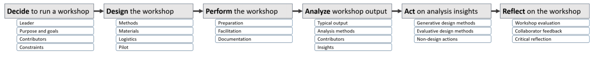
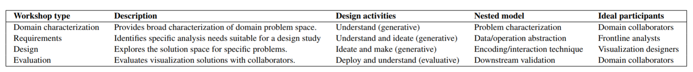

- Created a draft of the framework, summarized below, based on the aforementioned Ph.D. proposal.
- Key ideas in this draft include:
  - It referred to the use of _critically reflective practice_.
  - It characterized workshops based on their role in the design process.
  - It did not yet capture the iterative nature of workshop design.
- Reflecting on this draft revealed shortcomings of our ideas, which we subsequently addressed with more formal analysis methods.

|  |
| A graphical summary of an early framework draft. This would ultimately become the three-stage process model for CVO workshops. |

|  |
| We tried to characterize workshops by how they influence visualization design and decision models. Ultimately, we focused domain characterization and requirements workshops, which we termed CVO workshops. |
