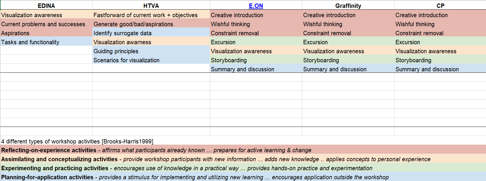
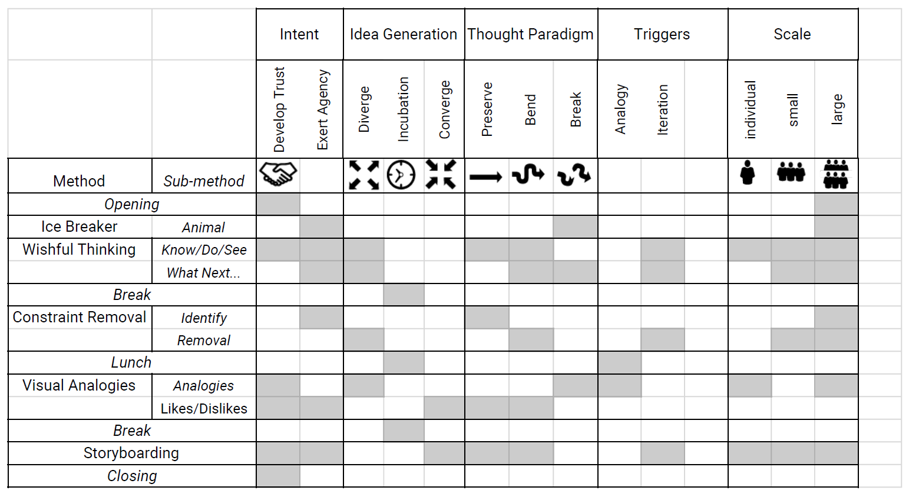
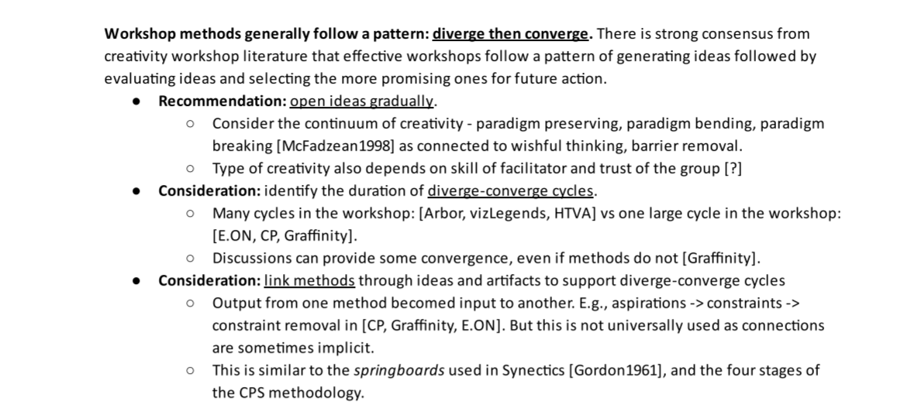

- Analyzed CVO [workshop methods (xlsx)] using frameworks for educational and creativity workshops.
- Listed 80+ [observations (xlsx)] about the process and design of workshops.
  - Connected each observation to our collective experience or existing theory.
  - Considered many approaches to group or rank the observations.
- Applied methods from design --- observations-to-insights and insight sorting --- to generate a list of [actionable insights (pdf)].
- Assisted planning and facilitating DiscoveryJam again.

|  |
| We tried to analyze methods in a number of ways. Here, we categorized workshop methods according to a framework for educational workshops. Although we decided that this framework was not directly applicable to CVO workshops, we include it to show one of the many alternatives that we considered. |

|  |
| Some ideas that do appear in our final framework are shown in this early _matrix of effects_ in which we tried to characterize methods by their impact on the workshop ideaspace. After further thinking, some of these characteristics were integrated into the _tactics for effective workshops_. |

|  |
| We collaboratively connected workshop recommendations with our experience and the existing literature. Some of the ideas contained in this insight appear in our final framework. |

[observations (xlsx)]: ../assets/documents/2017.09-observations.xlsx

[actionable insights (pdf)]: ../assets/documents/2017.09-insights-from-observations.pdf

[workshop methods (xlsx)]: ../assets/documents/2017.09-workshop-method-analysis.xlsx
