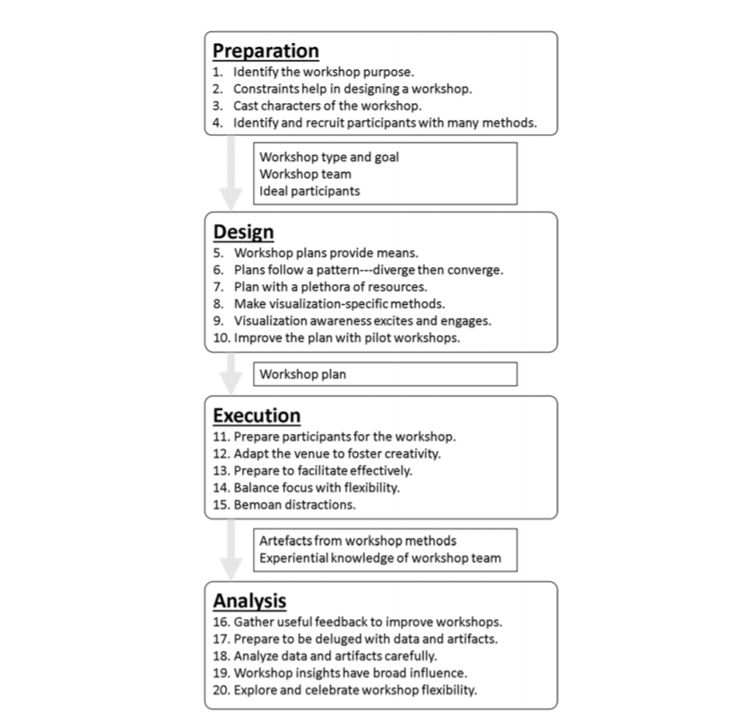
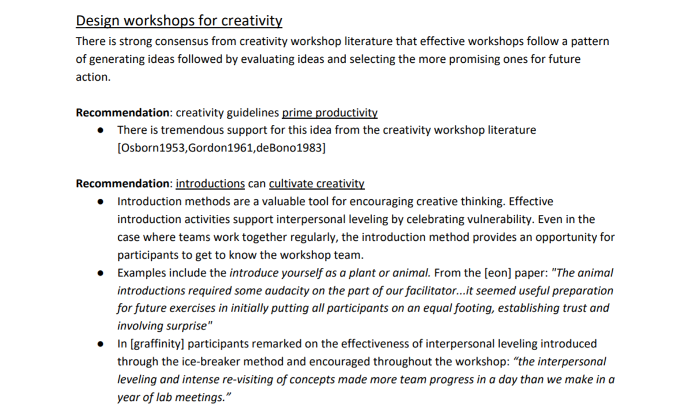
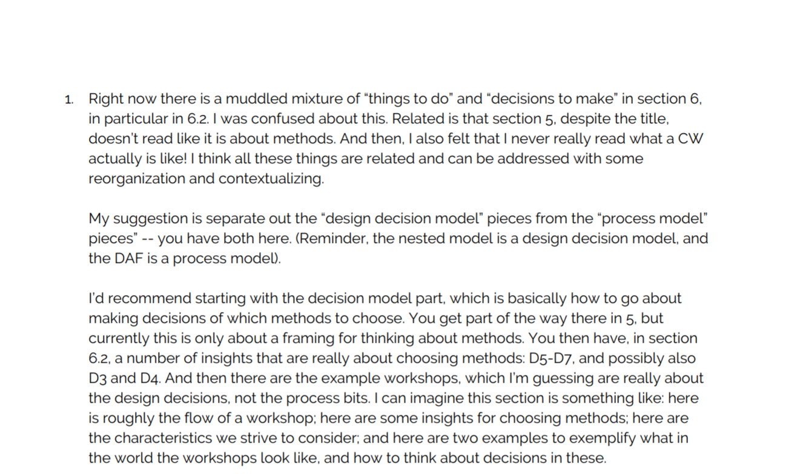

- Used collaborative writing and discussions to iteratively improve our actionable insights. Created many drafts of a 30+ page [collaborative reflection document (pdf)] that organized insights into a process model that identifies actions before, during, and after workshops.
- [Drafted paper (pdf)] based on recommendations in collaborative reflection document. Then, used structured written reflection to individually think about the draft.
- Collated responses in a single [reflection document (pdf)] that we used to identify the next steps of action for our analysis.

|  |
| Summary of the process model with insights for each of the stages. Each insight is connected to our experience and creativity literature. |

|  |
| One insight from our process model. Here, we have started to identify key ideas that would ultimately become part of the _workshop opening_ in our final framework. |

|  |
| As part of our reflective process, we individually wrote about ways to improve our ideas. One suggestion is shown here. It ultimately inspired the structure of our framework's two interconnected models: the process and structure.  |

[collaborative reflection document (pdf)]: ../assets/documents/2017.10-recommendations-and-reflection.pdf

[Drafted paper (pdf)]: ../assets/documents/2017.11-collaborative-reflection-draft.pdf

[reflection document (pdf)]: ../assets/documents/2017.11-collaborative-reflection-response.pdf
