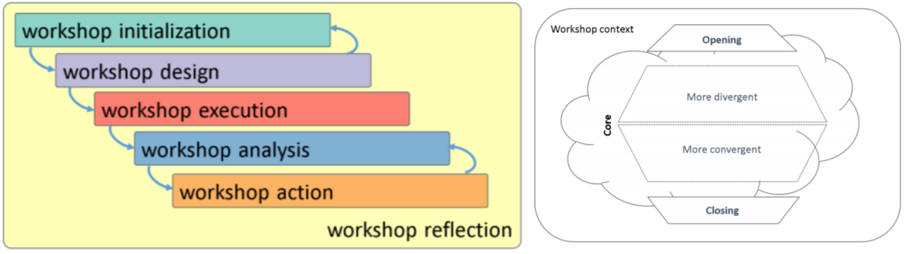
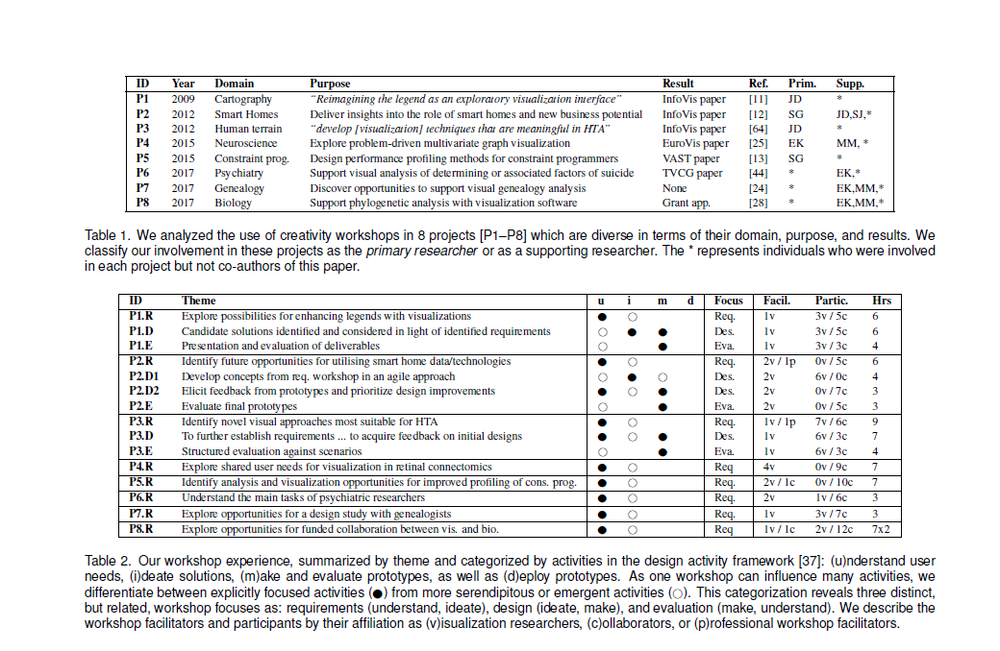

- Rewrote the [paper draft (pdf)] based on the collaborative reflection_
- Tried many ways to split the workshop _process_ from the workshop _structure_:
  - Applied [bottom-up analysis (pdf)]; identified traits of methods from existing literature; decided this was not actionable.
  - Framed methods as [creativity support tools (pdf)]; these ideas would become the _tactics for effective workshops_.
  - Tried [top-down analysis (pdf)]; described the opening, core, and closing; ultimately inspiring the workshop structure.
- Assembled an early version of this audit trail. Repeatedly revisited it in our subsequent analysis and writing.

|:--:|
| |
| Two early diagrams of the workshop process and structure. In the process (left), we show the iterative nature of workshop design. In the structure (right), we have identified the opening, core, and closing but have not yet figured out how to effectively represent it. Here, it looks like an exploding styrofoam takeout container. |

|:--:|
| |
| We also wrestled with how to summarize our workshop experience as shown in these two tables. Here, we tried to display _all_ of our workshop experience, including workshops that were used as part of a series. Later, we would focus explicitly on the _first_ workshop used in a series. |

[paper draft (pdf)]: ../assets/documents/2017.12-draft.pdf

[Bottom-up analysis (pdf)]: ../assets/documents/2017.12-workshop-design-bottom-up.pdf

[Top-down analysis (pdf)]: ../assets/documents/2017.12-workshop-design-top-down.pdf

[Creativity support tools (pdf)]: ../assets/documents/2018.01-creativity-support-draft.pdf
