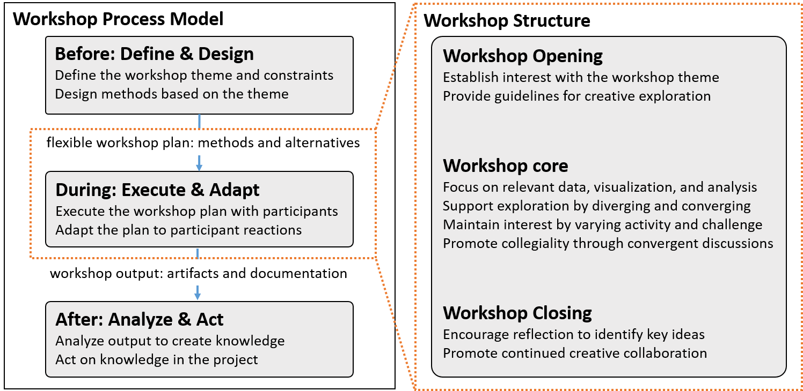
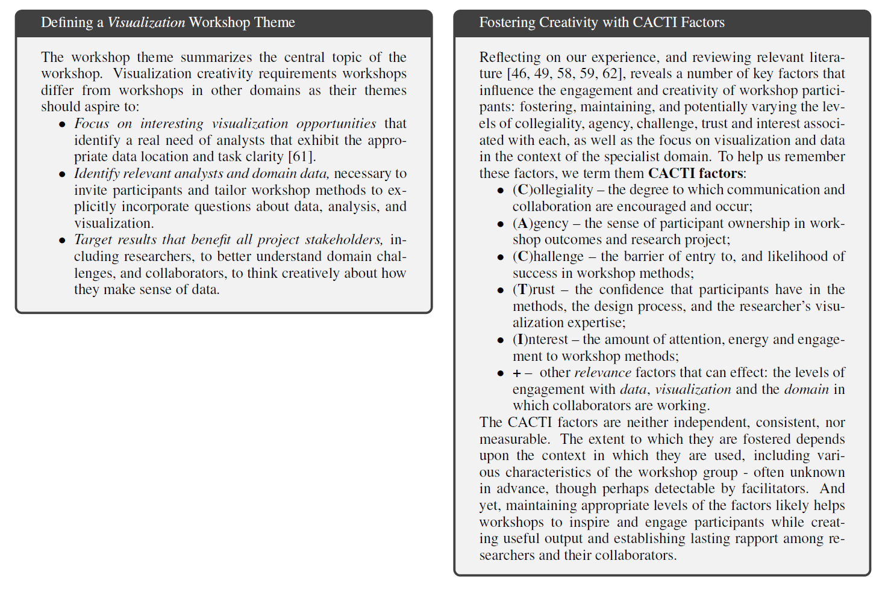

- After another round of individual written reflection, wrote a [draft (pdf)] in which we tried to present concepts about workshops but without explicit recommendations for future workshops because we were not sure that the recommendations helped with our workshop analysis.
- [Rewrote the draft (pdf)] based on feedback from colleagues who were using workshops in their own visualization research projects. Decided that the framework was starting to become understandable and actionable.

|:--:|
| |
| A diagram of the workshop process and structure that closely resembles what appears in our final paper. Here, we define the key aspects of the process and structure.  |

|:--:|
| |
| An early version of the _tactics_ were called _cacti_ factors but we updated them to place more emphasis on the critical role of data, visualization, and analysis in visualization creativity workshops. |

[draft (pdf)]: ../assets/documents/2018.01-draft-shared-with-group.pdf

[Rewrote the draft (pdf)]: ../assets/documents/2018.02-draft-with-callouts.pdf
